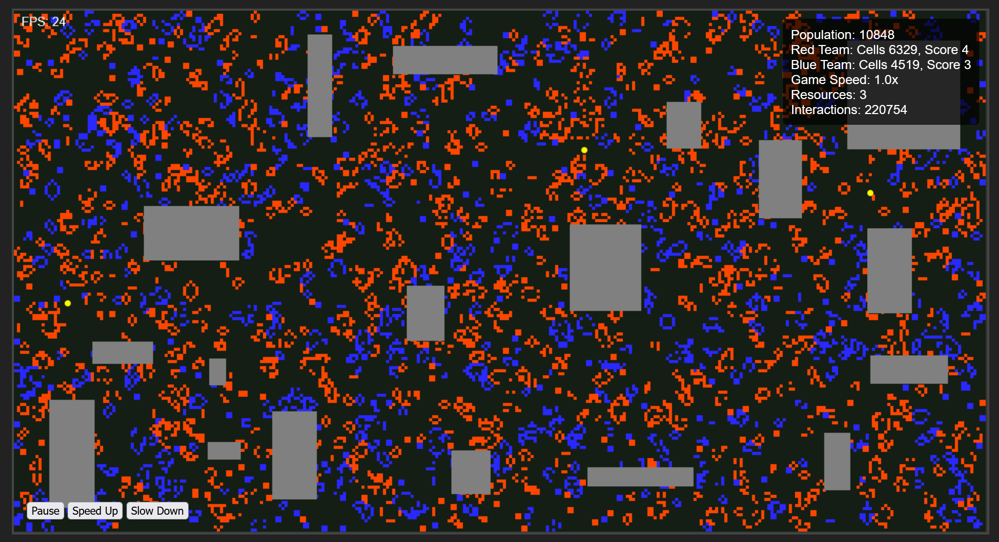

# Conway's Evolved Game of Life with Teams



## Overview

This project is an enhanced version of Conway's Game of Life, featuring two competing teams (red and blue), resources, and dynamic events. The game is built using JavaScript and HTML5 Canvas, providing an interactive and visually engaging experience.

## Features

- **Two-Team Competition**: Cells belong to either the red or blue team, competing for dominance on the grid.
- **Resource Management**: Resources spawn randomly on the grid, providing score boosts to teams that capture them.
- **Dynamic Events**:
  - **Storms**: Random events that clear cells in a specific area.
  - **Mutations**: Cells have a small chance of changing teams when reproducing or surviving.
- **Interactive Controls**: Pause, resume, and adjust game speed in real-time.
- **Responsive Design**: The game grid adapts to the browser window size.
- **Performance Optimized**: Efficient algorithms ensure smooth gameplay even with large grids.

## Game Rules

1. The game follows the basic rules of Conway's Game of Life, with modifications for team play.
2. Cells with fewer than 2 or more than 3 neighbors die.
3. Dead cells with exactly 3 neighbors of the same team come to life.
4. Resources are captured by the team that occupies their space.
5. Storms occasionally clear random areas of the grid.
6. Cells have a small chance of mutating to the opposite team.

## Project Structure

- `index.html`: The main HTML file that sets up the game container and UI elements.
- `styles.css`: CSS file for styling the game interface.
- `gameEngine.js`: Core game logic, including grid updates and game rules.
- `renderer.js`: Handles the rendering of the game grid and resources on the canvas.
- `stateManager.js`: Manages game state, including pausing, resuming, and speed control.

## Installation and Setup

1. Clone the repository:
   ```
   git clone https://github.com/N3BB3Z4R/conways-teams.git
   ```

2. Navigate to the project directory:
   ```
   cd conways-teams
   ```

3. Install dependencies:

   ```
   npm install
   ```
4. Start the development server:
   ```
   npm start
   ```

5. Open your browser and go to `http://localhost:3000` to play the game.

## Usage

- The game starts automatically when you open the page.
- Use the control panel to:
  - Pause/Resume the game
  - Increase/Decrease game speed
- Watch as the two teams compete for dominance and resources.
- Observe occasional storms and mutations that add unpredictability to the game.
